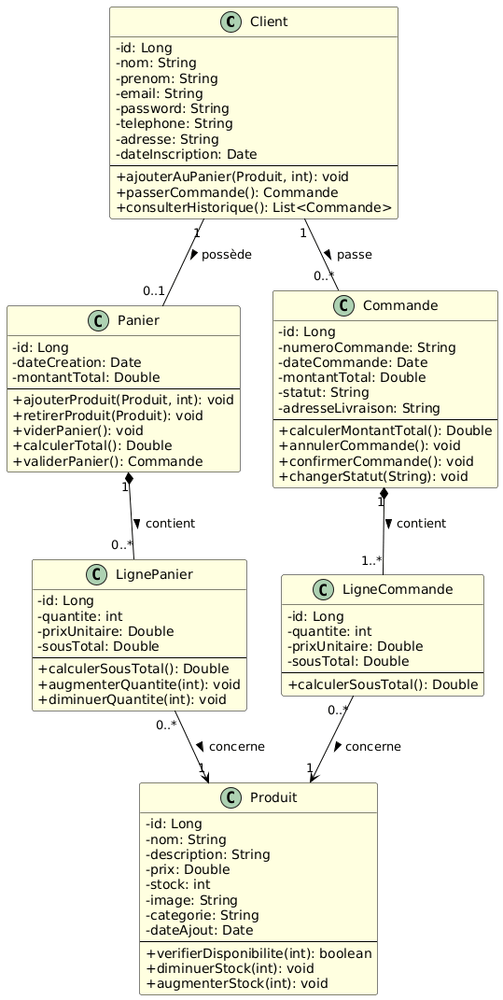
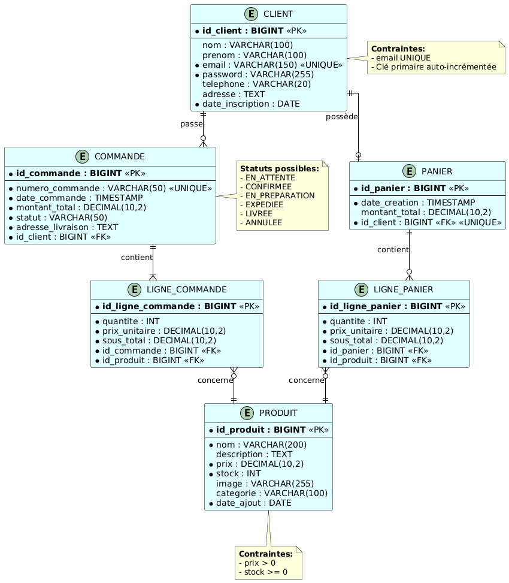

Mini Rapport - Application Web E-Commerce avec JSF et JPA

Cours: Applications Distribuées JEE
Enseignant: Pr. ELAACHAK LOTFI
Institution: Université Abdelmalek Essaadi - Faculté des Sciences et Techniques de Tanger
Département: Génie Informatique
Cycle: LSI

Objectif
Développement d'une application web e-commerce simulant la gestion d'un panier, d'une vitrine et des internautes, en maîtrisant l'API JPA (Java Persistence API) et le Framework JSF.

Technologies Utilisées
1. JavaServer Faces (JSF) 4.0

Description: Framework MVC pour le développement d'interfaces utilisateur web en Java
Avantages utilisés:

Composants UI réutilisables
Liaison automatique des données (data binding)
Gestion du cycle de vie des composants
Navigation déclarative entre les pages

2. Java Persistence API (JPA) 3.0

Description: Spécification standard pour la persistance des données en Java
Avantages utilisés:

Mapping objet-relationnel (ORM)
Indépendance vis-à-vis du fournisseur de persistance
Requêtes orientées objet (JPQL)
Gestion automatique des transactions

3. Hibernate

Description: Implémentation JPA utilisée comme fournisseur de persistance (au lieu d'EclipseLink)
Avantages utilisés:

Performance optimisée avec le cache de premier et second niveau
Génération automatique du schéma de base de données
Support étendu des types de données
Excellente documentation et communauté active
Meilleure gestion du lazy loading
Compatibilité avec diverses bases de données

4. MySQL

Description: Système de gestion de base de données relationnelle
Avantages utilisés:

Open source et gratuit
Performance élevée pour les applications web
Facilité d'administration
Large support communautaire

5. WildFly

Description: Serveur d'applications Java EE
Avantages utilisés:

Support complet de Jakarta EE
Déploiement rapide
Gestion intégrée des ressources
Console d'administration intuitive

6. PrimeFaces

Description: Bibliothèque de composants UI pour JSF
Avantages utilisés:

Composants riches et modernes
Thèmes personnalisables
Support AJAX intégré
Compatible avec JSF 4.0

7. Maven

Description: Outil de gestion de projet et de dépendances
Avantages utilisés:

Gestion centralisée des dépendances
Build automatisé
Structure de projet standardisée
Intégration avec IntelliJ IDEA

8. CDI (Contexts and Dependency Injection)

Description: Spécification pour l'injection de dépendances en Java EE
Avantages utilisés:

Couplage faible entre composants
Gestion des scopes (session, request, application)
Injection automatique des beans managés

Modélisation
Diagramme de Classes UML

Client: Gestion des utilisateurs (internautes)
Panier: Gestion du panier d'achat
Commande: Gestion des commandes
LignePanier: Détails des produits dans le panier
LigneCommande: Détails des produits dans une commande
Produit: Catalogue des produits

Modèle Logique de Données (MLD)

Tables normalisées
Clés primaires et étrangères
Contraintes d'intégrité (email UNIQUE, prix > 0, stock >= 0)
Types de données appropriés (BIGINT, VARCHAR, DECIMAL, TIMESTAMP)

Architecture de l'Application
Couche Modèle (JPA Entities)

Annotations JPA pour le mapping objet-relationnel
Relations entre entités (@OneToMany, @ManyToOne)
Cascade et fetch strategies
Génération automatique des clés primaires

Couche Contrôleur (Managed Beans)

Beans CDI avec scopes appropriés
Logique métier
Interaction avec la couche persistance
Gestion des événements utilisateur

Couche Vue (XHTML + PrimeFaces)

Pages XHTML avec composants JSF
Intégration de PrimeFaces pour l'interface riche
Data tables, formulaires, dialogues
Navigation entre les pages

⚙️ Configuration
persistence.xml
Configuration de l'unité de persistance JPA avec Hibernate:

Connexion à MySQL
Stratégie de génération du schéma
Propriétés Hibernate spécifiques

web.xml
Configuration du servlet JSF et des paramètres de l'application web
beans.xml
Activation de CDI pour la découverte des beans

Fonctionnalités Implémentées

Gestion des Clients

Inscription et authentification
Profil utilisateur

Gestion des Produits (Vitrine)

Affichage du catalogue
Recherche et filtrage
Vérification de disponibilité

Gestion du Panier

Ajout/suppression de produits
Calcul du montant total
Persistance du panier

Gestion des Commandes

Passage de commande
Historique des commandes
Suivi des statuts

Points Techniques Importants
Choix d'Hibernate vs EclipseLink
Hibernate a été préféré à EclipseLink pour les raisons suivantes:

Maturité: Plus ancien et plus éprouvé dans l'industrie
Performance: Système de cache sophistiqué (L1 et L2)
Communauté: Documentation abondante et support actif
Fonctionnalités: Extensions propriétaires utiles au-delà de JPA standard
Expérience: Plus familier pour l'équipe de développement

Gestion des Transactions

Transactions gérées par le conteneur (CMT)
Propagation et isolation configurables
Rollback automatique en cas d'exception

Relations JPA

Mapping bidirectionnel avec attention à la sérialisation
Utilisation de @JsonIgnore si nécessaire pour les API REST futures
Lazy loading pour optimiser les performances

Compétences Acquises

Maîtrise de l'architecture JPA/Hibernate
Développement d'interfaces web avec JSF et PrimeFaces
Modélisation de bases de données relationnelles
Gestion des dépendances avec Maven
Configuration et déploiement sur serveur d'applications
Injection de dépendances avec CDI
Bonnes pratiques de développement Java EE

Conclusion
Ce projet a permis de mettre en pratique les concepts fondamentaux du développement d'applications web Java EE, en combinant JPA pour la persistance, JSF pour la présentation, et CDI pour l'injection de dépendances. L'utilisation d'Hibernate comme implémentation JPA a offert une expérience solide et performante pour la gestion de la couche persistance.
